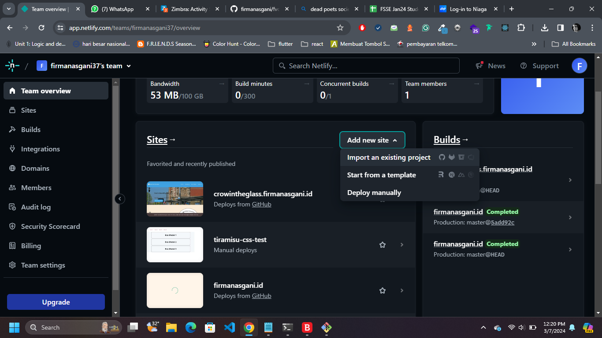
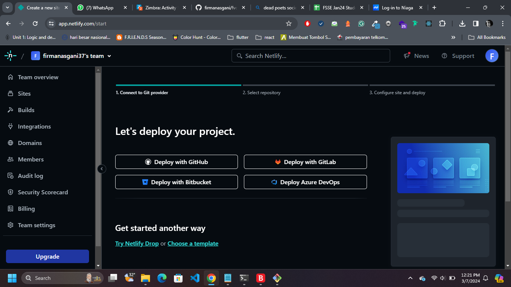
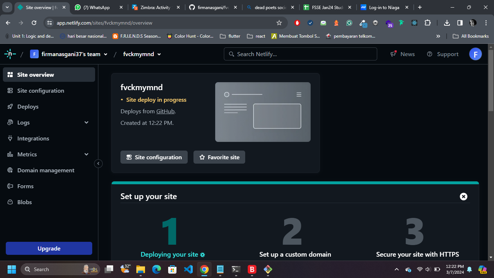
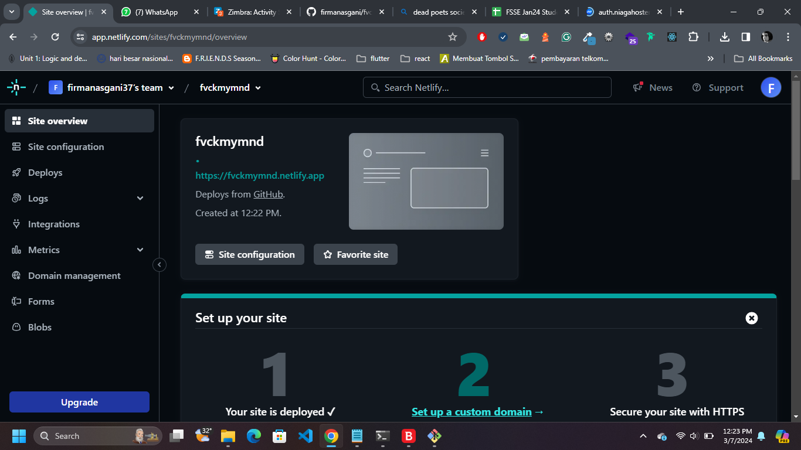
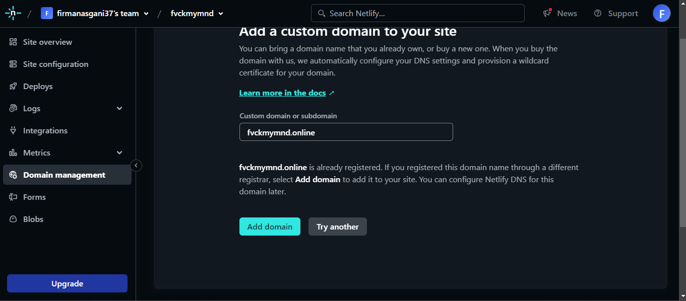
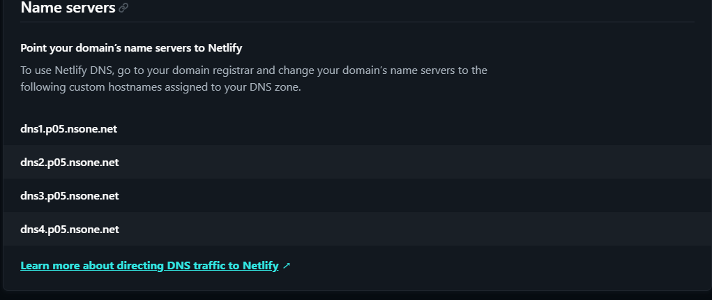
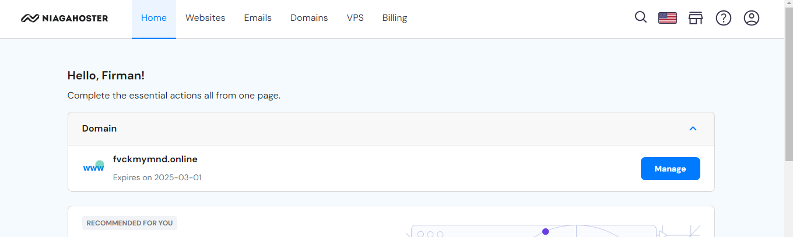
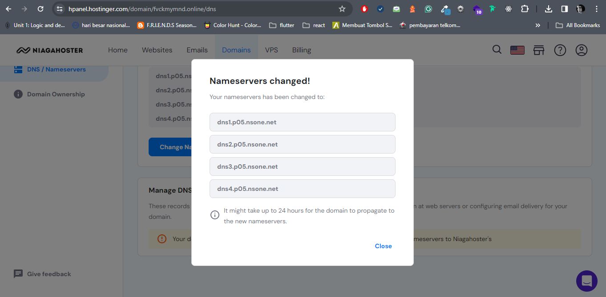

# FVCKMYMND

Website FVCKMYMND adalah website content yang bergerak di bidang *poetry*. Seperti halnya *button poetry* atau nitch, website ini berisi tentang orang-orang yang memberi dampak ke masyarakat umum. Sebagian dari mereka bukan seorang *poet*, namun kata-kata mereka berdampak bagi orang lainnya.

## Isi website 

Website ini berisi dari tiga halaman:
1. Halaman Index: Halaman utama yang berisi banner, dan Article
    a. Banner berisi gambar dan sebuah tagline (diambil dari film dead poets society)
    b. quotes atau kata-kata dari orang-orang
    c. Footer
2. Halaman Blog: halaman yang secara spesifik berisi tentang orang-orang berdasarkan profesi mereka.
3. newsletter: hanya halaman berisi satu input email dan button subscribe. 

## Apa yang saya gunakan?
1. Sebuah akun github.
Ya, saya menggunakan github untuk menyimpan source code. Github saya juga digunakan untuk hosting di netlify. 
2. Sebuah akun netlify.
Akun Netlify dibutuhkan untuk hosting. Akun ini juga bisa terintegrasi dengan akun github. sehingga saat ada perubahan akan langsung terdeteksi dan perubahan terjadi secara otomatis. 
3. Domain
Domain terdaftar di niagahoster. Untuk DNS akan menggunakan DNS dari netlify.
4. RESTFul API.
Data yang saya ambil ada di sebuah API. Saya mengambil API tersebut dan menggunakan setidaknya 3 endpoints.

## RESTFUL API
Saya menggunakan API untuk mengambil data, mulai dari gambar, text, dan alt picture untuk membuat data fluid. Resource API diambil di [sini](https://quotes.crowintheglass.com/api/v1/characters/quotes)

Yang unik adalah, setiap data tersebut menggenerate foto dan tulisan yang berbeda-beda.

Adapun endpoint yang digunakan ada 3:
<ul>
<li> /characters/quotes untuk generate quotes</li>
<li> /characters/occupation untuk mengambil profesi dari tokoh</li>
<li> /characters/occupation/{param} untuk mengambil data tokoh berdasarkan profesi</li>
</ul>

## Bagaimana cara menghubungkan netlify ke domain?
1. Pertama, isilah nama site dan pastikan site tersebut kosong atau available

2. Jika sudah, hubungkan ke akun github dan koneksikan ke repository yang sudah disiapkan.

3. Setelah itu, akan ada proses dari pengambilan repo dari git sampai pemasangan SSL untuk domain dari netlify

4. Jika sudah selesai, maka hubungkan hosting tersebut ke domain tersedia. Disini saya menggunakan domain dari niagahoster.

5. Jika sudah, maka masukan nameservers yang telah diberikan netlify ke domain niagahoster.

6. Disini saya ada satu domain, yaitu domain [fvckmynd.online](https://fvckmymnd.online)

7. Jika sudah selesai, maka hanya tinggal menunggu waktu propagansi sampai domain up.